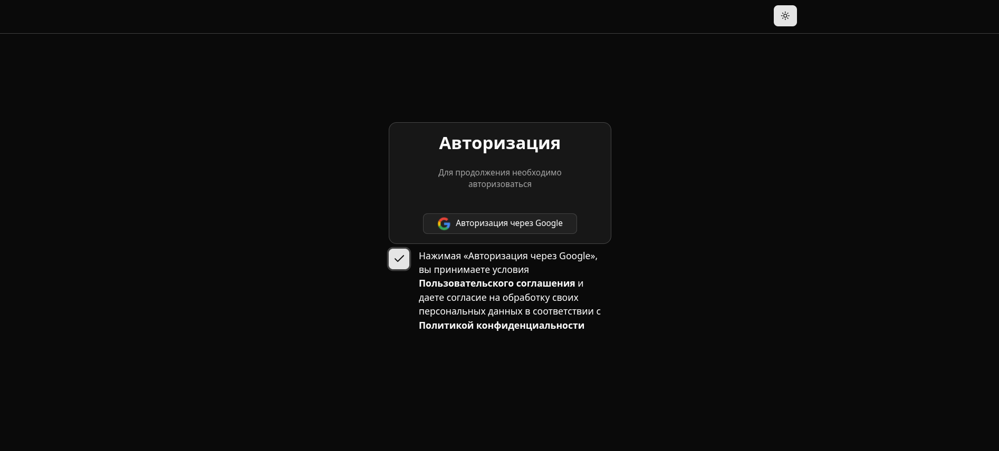
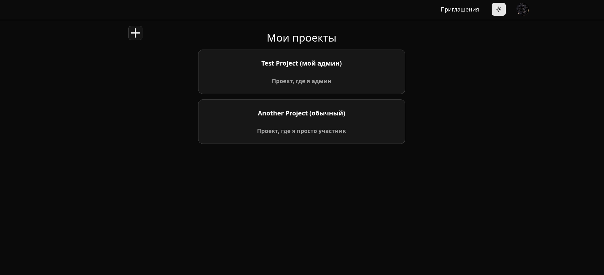
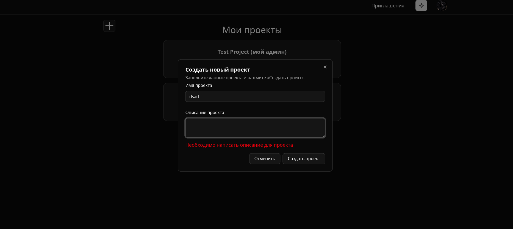
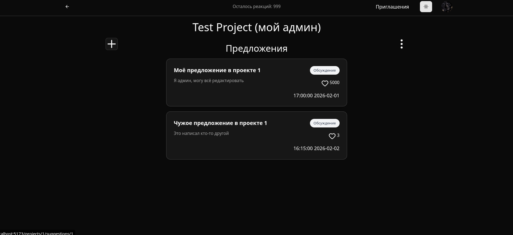
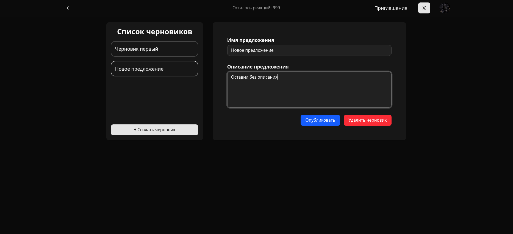
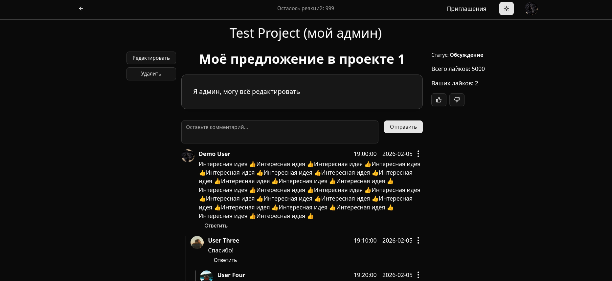
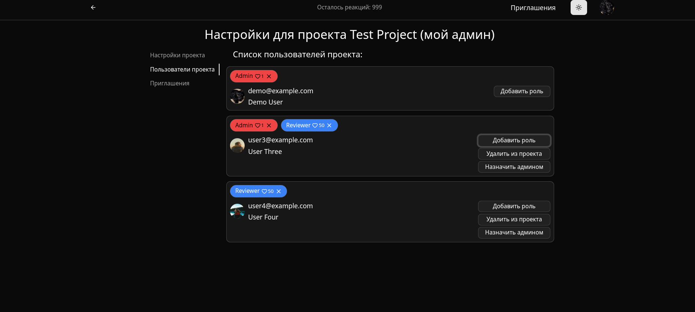

# Collaboration System

Collaboration system - A platform for collaborative idea sharing and decision-making inside teams and communities.

---

## Features

### Authentication & Authorization

- JWT-based authentication
- Role-based access control
- Google authrorization

### Projects

- Create and manage projects
- Project administrators
- Project configuration settings
- Invitation system with email agent

### Suggestions System

- Create improvement suggestions
- Edit and update suggestions
- Suggestion drafts with autosave synchronization

### Voting

- Vote for suggestions
- Limited number of votes per user for a certain period of time (e.g. hour, week, month)
- Vote cancellation

### Roles

- Defining a user's role
- The number of reactions available for each role

### Comments

- Comments under suggestions
- Nested replies

### Suggestion Statuses

- New
- In Progress
- Accepted
- Rejected

### API

- RESTful API
- OpenAPI specification

---

# Tech Stack

## Frontend

- TypeScript
- React
- React Router
- Tailwind
- Tanstack Query
- React Hook Form
- Vite

## Backend

- Java
- Spring Boot
- PostgreSQL

## Additionals

- Docker

---

# Architecture

```text
┌────────────────────┐
│      Frontend      │
│   React + TS UI    │
└─────────┬──────────┘
          │ REST API
          ▼
┌────────────────────┐
│      Backend       │
│ Spring Boot Server │
└─────────┬──────────┘
          │
          ▼
┌────────────────────┐
│     PostgreSQL     │
│      Database      │
└────────────────────┘
```

---

# Project Structure

```text
collaboration-system/
│
├── frontend/          # React frontend (FSD)
│   └── openapi.yaml       # OpenAPI specification
├── backend/           # Spring Boot backend
│   └── database/       # SQL Database files
└── README.md
```

---

# Getting Started

## Prerequisites

- Java 21+
- Node.js 20+
- Docker
- Docker Compose

---

# ⚙️ Installation

## 1. Clone repository

```bash
git clone https://github.com/your-username/collaboration-system.git
cd collaboration-system
```

---

## 2. Start database

```bash
cd backend
docker compose up -d
```

---

## 3. Start backend

```bash
cd backend
./gradlew bootRun
```

Backend will start on:

```text
http://localhost:8080
```

---

## 4. Start frontend

```bash
cd frontend
npm install
npm run dev
```

Frontend will start on:

```text
http://localhost:5173
```

---

# Environment Variables

## Backend

Create `.env` file:

```env
DB_URL=jdbc:postgresql://localhost:5432/collaboration_system
DB_USERNAME=postgres
DB_PASSWORD=postgres

JWT_SECRET=your_secret_key

GOOGLE_CLIENT_ID=your_google_client_id
GOOGLE_CLIENT_SECRET=your_google_client_secret
```

---

# API

The project uses RESTful API principles.

OpenAPI specification:

```text
/frontend/openapi.yaml
```

---

## Example Endpoints

### Projects

| Method | Endpoint         | Description       |
| ------ | ---------------- | ----------------- |
| GET    | `/projects`      | Get all projects  |
| POST   | `/projects`      | Create project    |
| GET    | `/projects/{id}` | Get project by id |

---

### Suggestions

| Method | Endpoint            | Description       |
| ------ | ------------------- | ----------------- |
| GET    | `/suggestions`      | Get suggestions   |
| POST   | `/suggestions`      | Create suggestion |
| PATCH  | `/suggestions/{id}` | Update suggestion |

---

### Comments

| Method | Endpoint                                | Description    |
| ------ | --------------------------------------- | -------------- |
| GET    | `/suggestions/{suggestion_id}/comments` | Get comments   |
| POST   | `/suggestions/{suggestion_id}/comments` | Create comment |

---

# Core Concepts

## Suggestion Lifecycle

```text
New
  ↓
In Progress
  ↓
Accepted / Rejected
```

---

## Voting System

Each user has a limited number of votes available inside a project.

Users can:

- allocate votes to important ideas
- remove an already set reaction

---

# Screenshots

## Auth Page



## Projects Page





## Suggestion Page



## Create Suggestion Page



## Suggestion Page



## Project Settings Page


